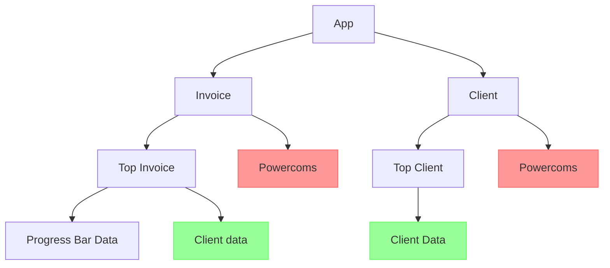
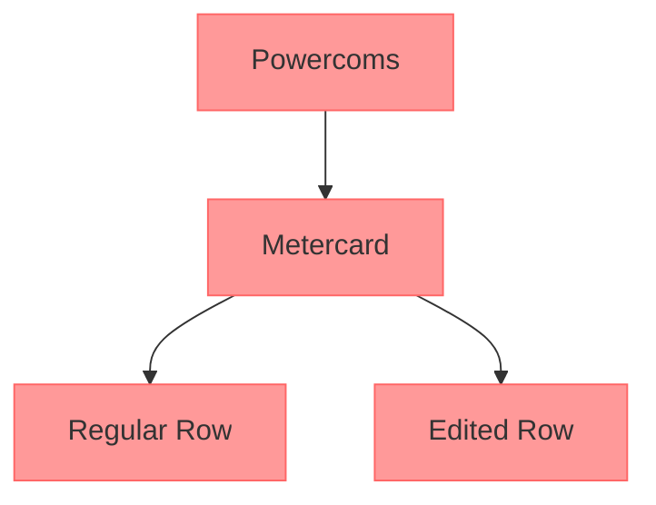

# fdy

## Project setup.

```
npm install
```

### Compiles and hot-reloads for development

```
npm run serve
```

### Compiles and minifies for production

```
npm run build
```

### Lints and fixes files

```
npm run lint
```

### Customize configuration

See [Configuration Reference](https://cli.vuejs.org/config/).

# Documentation

## Overview

This application features two distinct screens, each providing valuable insights into metercards. These perspectives offer detailed information from both an invoice and a client point of view.

## Files structure

-   src
    -   App.vue
    -   helpers.js
    -   main.js
    -   quasar-user-options.js
    -   testHelpers.js
    -   components
        -   ClientData.vue
        -   Loader.vue
        -   Welcome.vue
        -   Powercom
            -   Powercom.vue
            -   components
                -   Metercards
                    -   Metercards.vue
                    -   components
                        -   MetercardEditRow.vue
                        -   MetercardRow.vue
    -   router
        -   index.js
    -   store
        -   editedMetercard.js
        -   invoice.js
    -   styles
        -   layout.colorpalette.scss
        -   layout.fonts.scss
        -   layout.general.scss
        -   quasar.scss
        -   quasar.variables.scss
    -   views
        -   client-screen
            -   Client.vue
            -   components
                -   TopClient.vue
        -   invoice-screen
            -   Invoice.vue
            -   components
                -   TopInvoice.vue
                -   components
                    -   ProgressBar.vue

## Routing

The application primarily comprises just two main routes, leading users to either the Client screen or the Invoice screen.

## State Management

Within the application, there are two distinct stores responsible for managing data:

### Invoice Store

This primary store handles application data and is referred to as the "invoice store." While it's the main store for the application, it also caters to the client screen. Notably, the client screen lacks "invoice" data, setting it apart from the invoice screen.

### Edit Metercard Store

The second store is dedicated to tracking changes in the edited Metercard values. This store focuses on providing a clear overview of any modifications made to the edited Metercard data.

## Components Structure



### Explain

Both the central components, Invoice and Client, share a common child component known as Powercoms.

### The powercoms component structure



### Explain

Each Powercom is associated with multiple Metercards. Certain Metercards have the potential to be edited, allowing users to transform a "Regular" Metercard into an "Edited" Row by clicking the "Edit" icon. Notably, whenever a new Metercard is added, it is introduced as an "Edited" Metercard right from the outset.
